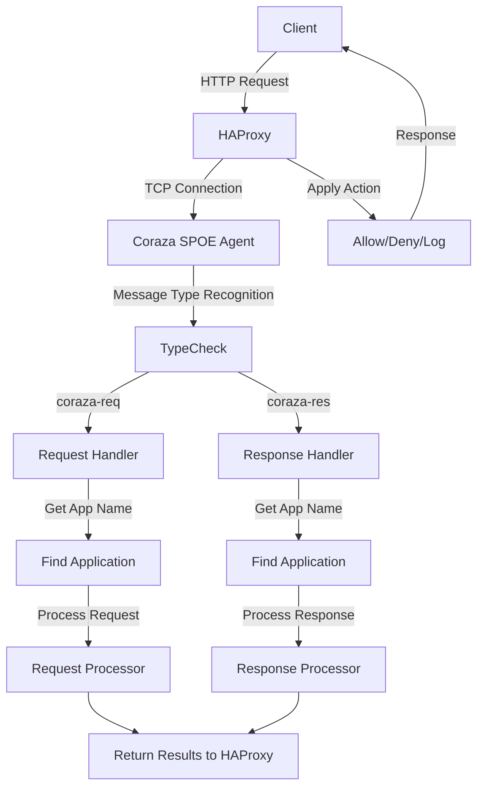

# RuiQi WAF

<div align="center">
  
  
  
  
</div>

<br>

A modern web application firewall (WAF) management system built on top of [HAProxy](https://www.haproxy.org/) and [OWASP Coraza WAF](https://github.com/corazawaf/coraza) with the [Coraza SPOA](https://github.com/corazawaf/coraza-spoa) integration. This system provides a comprehensive backend API for managing HAProxy configurations, Coraza WAF rules, and traffic inspection.

## Core Architecture

Simple WAF implements a modular architecture with HAProxy at the front handling traffic and Coraza WAF providing security inspection through SPOE (Stream Processing Offload Engine):



### SPOE Communication Workflow

```
[HAProxy Request] → [internal.Agent.Serve(Listener)] 
                          ↓
                   Create spop.Agent
                   agent := spop.Agent{
                       Handler: a,
                       BaseContext: a.Context,
                   }
                          ↓
                [spop.Agent.Serve(Listener)]
                          ↓
                   Accept new connections
                   nc, err := l.Accept()
                          ↓
                   Create protocol handler
                   p := newProtocolClient(ctx, nc, as, handler)
                          ↓
                   Start goroutine for connection
                   go func() { 
                       p.Serve() 
                   }()
                          ↓
                [protocolClient.Serve]
                   Process frames in connection
                          ↓
                [frameHandler processes Frame]
                   Dispatch based on frame type
                          ↓
                [onNotify handles messages] 
                   Create message scanner and objects
                   Call Handler.HandleSPOE
                          ↓ 
                [internal.Agent.HandleSPOE processing]
                          ↓
                   Parse message type (coraza-req/coraza-res)
                          ↓
                   Get application name
                          ↓
                   Find Application
                          ↓
                   Execute message handler
                          ↓
                   Process return results
                          ↓
                [Return to HAProxy]
```

## Project Structure

```
├── coraza-spoa/              # Coraza SPOE Agent implementation
│   ├── cmd/                  # Entry point package
│   ├── internal/             # Internal implementation
│   │   ├── log_store/        # WAF log storage handler
│   │   ├── agent/            # SPOE agent implementation
│   │   └── application/      # SPOE request/response handlers
│   └── pkg/                  # External packages
├── pkg/                      # Shared packages
│   ├── database/mongo/       # MongoDB integration (v2 driver)
│   ├── utils/                # Utility functions
│   └── model/                # Shared data models
├── server/                   # Backend API service
│   ├── config/               # Configuration handling
│   ├── controller/           # API controllers
│   ├── dto/                  # Data Transfer Objects
│   ├── model/                # Data models
│   ├── repository/           # Data access layer
│   ├── service/              # Business logic
│   │   ├── daemon/           # Service management
│   │   ├── engine/           # Coraza WAF management
│   │   └── haproxy/          # HAProxy management
│   ├── router/               # API routes with RBAC
│   └── middleware/           # Gin middleware
└── web/                      # Frontend (TBD)
```

## Features

- **HAProxy Integration**
  - Full HAProxy lifecycle management (start, stop, restart)
  - Dynamic configuration generation
  - Real-time status monitoring

- **Coraza WAF Integration**
  - OWASP Core Rule Set (CRS) support
  - ModSecurity SecLang rule compatibility
  - Custom rule management
  - WAF engine lifecycle management

- **Advanced Security**
  - HTTP request inspection
  - HTTP response inspection
  - Real-time attack detection and prevention
  - RBAC user permission system

- **Monitoring and Logging**
  - WAF attack logs and analytics
  - Traffic statistics
  - Performance metrics

- **API-Driven Workflow**
  - RESTful API with Gin framework
  - Swagger/ReDoc API documentation
  - JWT authentication

## Getting Started

### Prerequisites

- Go 1.24.1 or higher
- HAProxy 2.x
- MongoDB 5.x or higher
- Coraza SPOA

### Installation

1. Clone the repository:

```bash
git clone https://github.com/HUAHUAI23/simple-waf.git
cd simple-waf
```

2. Install dependencies:

```bash
go mod download
```

3. Configure environment:

```bash
cp server/.env.template server/.env
# Edit .env with your configurations
```

4. Build and run:

```bash
go run server/main.go
```

The API server will start at `http://localhost:2333` by default.

## API Endpoints

### Auth
- POST `/api/v1/auth/login` - User login
- POST `/api/v1/auth/register` - User registration

### HAProxy Management
- GET `/api/v1/haproxy/status` - Get HAProxy status
- GET `/api/v1/haproxy/config` - Get HAProxy configuration
- POST `/api/v1/haproxy/config` - Update HAProxy configuration
- POST `/api/v1/haproxy/restart` - Restart HAProxy
- POST `/api/v1/haproxy/start` - Start HAProxy
- POST `/api/v1/haproxy/stop` - Stop HAProxy

### WAF Engine Management
- GET `/api/v1/engine/status` - Get WAF engine status
- GET `/api/v1/engine/config` - Get WAF engine configuration
- POST `/api/v1/engine/config` - Update WAF engine configuration
- POST `/api/v1/engine/restart` - Restart WAF engine
- POST `/api/v1/engine/start` - Start WAF engine
- POST `/api/v1/engine/stop` - Stop WAF engine

### Site Management
- GET `/api/v1/sites` - List all sites
- GET `/api/v1/sites/:id` - Get site details
- POST `/api/v1/sites` - Create new site
- PUT `/api/v1/sites/:id` - Update site
- DELETE `/api/v1/sites/:id` - Delete site

### WAF Logs
- GET `/api/v1/logs` - Get WAF logs
- GET `/api/v1/logs/stats` - Get WAF statistics

## License

This project is licensed under the MIT License - see the LICENSE file for details.

## Acknowledgements

- [OWASP Coraza WAF](https://github.com/corazawaf/coraza)
- [Coraza SPOA](https://github.com/corazawaf/coraza-spoa)
- [HAProxy](https://www.haproxy.org/)
- [Go Gin Framework](https://github.com/gin-gonic/gin) 